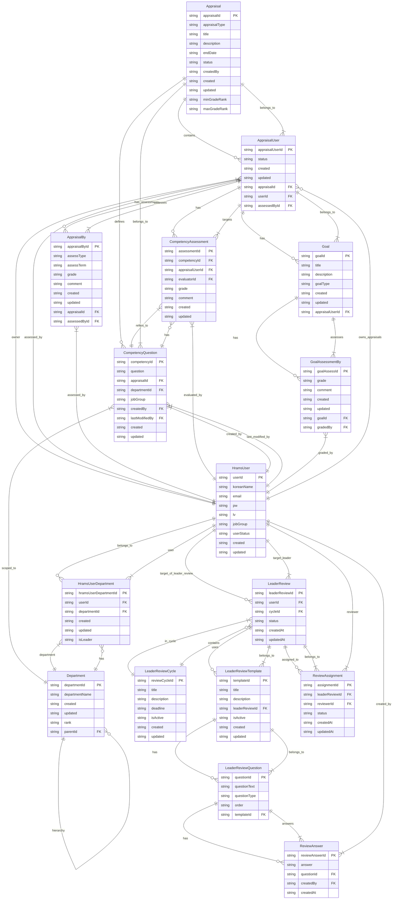

# Entity Relationship Diagram (ERD)

```mermaid
erDiagram
    Appraisal ||--o{ AppraisalUser : contains
    Appraisal ||--o{ CompetencyQuestion : defines
    
    AppraisalUser }|--|| Appraisal : belongs_to
    AppraisalUser }|--|| HramsUser : owner
    AppraisalUser }|--|| HramsUser : assessed_by
    AppraisalUser ||--o{ Goal : has
    AppraisalUser ||--o{ CompetencyAssessment : has
    AppraisalUser ||--o{ AppraisalBy : has_assessments

    AppraisalBy }|--|| AppraisalUser : assesses
    AppraisalBy }|--|| HramsUser : assessed_by

    CompetencyAssessment }|--|| CompetencyQuestion : refers_to
    CompetencyAssessment }|--|| AppraisalUser : targets
    CompetencyAssessment }|--|| HramsUser : evaluated_by

    CompetencyQuestion }|--|| Appraisal : belongs_to
    CompetencyQuestion }|--|| Department : scoped_to
    CompetencyQuestion }|--|| HramsUser : created_by
    CompetencyQuestion }|--|| HramsUser : last_modified_by
    CompetencyQuestion ||--o{ CompetencyAssessment : has 

    Department ||--o{ Department : hierarchy
    Department ||--o{ HramsUserDepartment : has

    Goal ||--o{ GoalAssessmentBy : has
    Goal }|--|| AppraisalUser : belongs_to

    GoalAssessmentBy }|--|| Goal : assesses
    GoalAssessmentBy }|--|| HramsUser : graded_by

    HramsUser ||--o{ HramsUserDepartment : belongs_to
    HramsUser ||--o{ AppraisalUser : owns_appraisals
    HramsUser ||--o{ LeaderReview : target_of_leader_review

    HramsUserDepartment }|--|| HramsUser : user
    HramsUserDepartment }|--|| Department : department

    LeaderReviewCycle ||--o{ LeaderReview : contains

    LeaderReview }|--|| HramsUser : target_leader
    LeaderReview }|--|| LeaderReviewCycle : in_cycle
    LeaderReview ||--o{ LeaderReviewTemplate : uses
    LeaderReview ||--o{ ReviewAssignment : assigned_to

    LeaderReviewTemplate }|--|| LeaderReview : belongs_to
    LeaderReviewTemplate ||--o{ LeaderReviewQuestion : has

    LeaderReviewQuestion }|--|| LeaderReviewTemplate : belongs_to
    LeaderReviewQuestion ||--o{ ReviewAnswer : has

    ReviewAssignment }|--|| LeaderReview : belongs_to
    ReviewAssignment }|--|| HramsUser : reviewer

    ReviewAnswer }|--|| LeaderReviewQuestion : answers
    ReviewAnswer }|--|| HramsUser : created_by

    Appraisal {
        string appraisalId PK
        string appraisalType
        string title
        string description
        string endDate
        string status
        string createdBy
        string created
        string updated
        string minGradeRank
        string maxGradeRank
    }

    AppraisalUser {
        string appraisalUserId PK
        string status
        string created
        string updated
        string appraisalId FK
        string userId FK
        string assessedById FK
    }

    AppraisalBy {
        string appraisalById PK
        string assessType
        string assessTerm
        string grade
        string comment
        string created
        string updated
        string appraisalId FK
        string assessedById FK
    }

    CompetencyAssessment {
        string assessmentId PK
        string competencyId FK
        string appraisalUserId FK
        string evaluatorId FK
        string grade
        string comment
        string created
        string updated
    }

    CompetencyQuestion {
        string competencyId PK
        string question
        string appraisalId FK
        string departmentId FK
        string jobGroup
        string createdBy FK
        string lastModifiedBy FK
        string created
        string updated
    }

    Department {
        string departmentId PK
        string departmentName
        string created
        string updated
        string rank
        string parentId FK
    }

    Goal {
        string goalId PK
        string title
        string description
        string goalType
        string created
        string updated
        string appraisalUserId FK
    }

    GoalAssessmentBy {
        string goalAssessId PK
        string grade
        string comment
        string created
        string updated
        string goalId FK
        string gradedBy FK
    }

    HramsUser {
        string userId PK
        string koreanName
        string email
        string pw
        string lv
        string jobGroup
        string userStatus
        string created
        string updated
    }

    HramsUserDepartment {
        string hramsUserDepartmentId PK
        string userId FK
        string departmentId FK
        string created
        string updated
        string isLeader
    }

    LeaderReviewCycle {
        string reviewCycleId PK
        string title
        string description
        string deadline
        string isActive
        string created
        string updated
    }

    LeaderReview {
        string leaderReviewId PK
        string userId FK
        string cycleId FK
        string status
        string createdAt
        string updatedAt
    }

    LeaderReviewTemplate {
        string templateId PK
        string title
        string description
        string leaderReviewId FK
        string isActive
        string created
        string updated
    }

    LeaderReviewQuestion {
        string questionId PK
        string questionText
        string questionType
        string order
        string templateId FK
    }

    ReviewAssignment {
        string assignmentId PK
        string leaderReviewId FK
        string reviewerId FK
        string status
        string createdAt
        string updatedAt
    }

    ReviewAnswer {
        string reviewAnswerId PK
        string answer
        string questionId FK
        string createdBy FK
        string createdAt
    }
```

